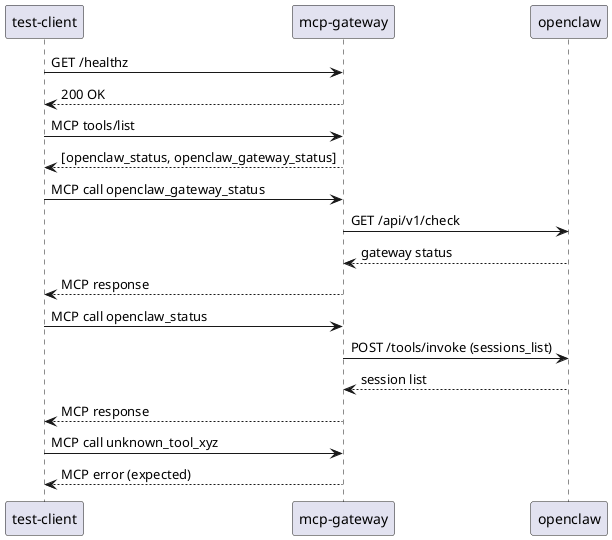

# OpenClaw MCP Gateway

A secure MCP HTTP server that gives AI agents limited, auditable access to an [OpenClaw](https://github.com/mwaeckerlin/openclaw) runtime over the network. It exposes a fixed allowlist of OpenClaw Gateway operations as MCP tools — no arbitrary shell execution, no dynamic endpoint routing, and no command injection is possible from MCP inputs.

The primary use case is sandboxed AI agents (e.g. running in Docker or SSH-isolated containers) that need to observe or interact with a running OpenClaw Gateway without having unrestricted network access to it. The gateway bridges the MCP protocol to OpenClaw's HTTP REST API, enforcing that only pre-approved operations can be invoked.

## OpenClaw

[OpenClaw](https://github.com/mwaeckerlin/openclaw) is an AI-agent runtime that provides a secure, sandboxed execution environment for browser automation, code execution, file management, and other tasks. It runs as a gateway service exposing a REST API and a tool invocation protocol. Agents connect to OpenClaw to delegate real-world actions to a controlled, auditable environment.

This MCP Gateway makes a curated subset of OpenClaw's API available to any MCP-compatible AI assistant, with all routing and payload construction fixed in the server — the MCP client cannot influence which endpoints are called or what is sent to them.

## MCP Tools

| MCP Tool | Method | OpenClaw Endpoint | Description |
|---|---|---|---|
| `openclaw_status` | `POST` | `/tools/invoke` (tool: `sessions_list`) | Lists active OpenClaw sessions |
| `openclaw_gateway_status` | `GET` | `/api/v1/check` | Checks OpenClaw gateway health |

## Security model

- No arbitrary shell execution
- No arbitrary command execution
- No dynamic endpoint selection from MCP input

## Configuration

| Variable | Required | Description |
|---|---|---|
| `OPENCLAW_GATEWAY_URL` | yes | Base URL of the OpenClaw Gateway, e.g. `http://localhost:18789` |
| `OPENCLAW_GATEWAY_TOKEN` | yes* | Bearer token for Gateway authentication |
| `OPENCLAW_GATEWAY_KEY` | yes* | Legacy alias for `OPENCLAW_GATEWAY_TOKEN` |
| `OPENCLAW_GATEWAY_KEY_FILE` | yes* | Path to a file containing the token (legacy) |
| `OPENCLAW_MCP_HOST` | no | Host to bind (default: `0.0.0.0`) |
| `OPENCLAW_MCP_PORT` | no | Port to listen on (default: `4000`) |

\* One of `OPENCLAW_GATEWAY_TOKEN`, `OPENCLAW_GATEWAY_KEY`, or `OPENCLAW_GATEWAY_KEY_FILE` is required. The file `/run/secret/openclaw_gateway_token` is also read automatically when it exists.

## Local Development

```bash
npm install
npm run build
npm test
```

Start the gateway:

```bash
OPENCLAW_GATEWAY_URL="http://127.0.0.1:18789" \
OPENCLAW_GATEWAY_TOKEN="your-gateway-token" \
npm start
```

The server listens on `http://<OPENCLAW_MCP_HOST>:<OPENCLAW_MCP_PORT>` (default: `http://0.0.0.0:4000`).

## Docker Compose

```bash
docker compose build
docker compose up --build --force-recreate --remove-orphans
```

Compose defaults (override via environment variables):

- `OPENCLAW_GATEWAY_URL=http://localhost:18789`
- `OPENCLAW_GATEWAY_TOKEN=test-gateway-token`

## End-to-End Tests

`test/docker-compose.yml` brings up three services and runs end-to-end assertions against a live OpenClaw gateway:



```bash
cd test
docker compose up --build --force-recreate --remove-orphans --abort-on-container-exit --exit-code-from test-client
```

Optional overrides:

- `OPENCLAW_E2E_GATEWAY_TOKEN` (default: `test-gateway-token`)
- `OPENCLAW_E2E_OPENAI_API_KEY` (default: `test-openai-key`)

## MCP Client Example

```json
{
  "mcpServers": {
    "openclaw-gateway": {
      "transport": "streamable-http",
      "url": "http://127.0.0.1:4000",
      "headers": {
        "Authorization": "Bearer your-gateway-token"
      }
    }
  }
}
```
