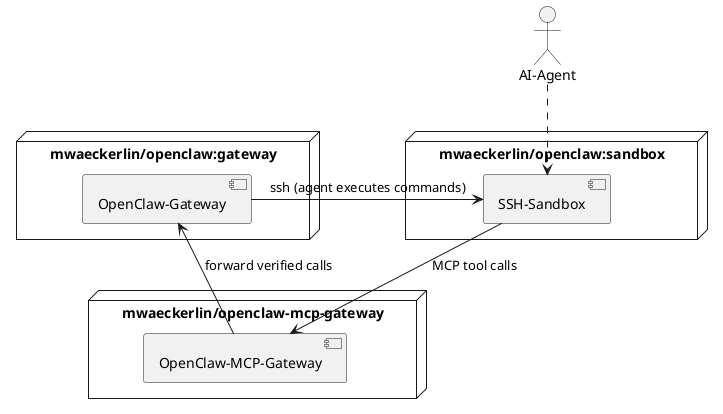

# Secure Access To OpenClaw From Sandbox

Give sandboxed SSH AI agents controlled access to [OpenClaw](https://github.com/mwaeckerlin/openclaw) through this MCP gateway service.

AI agents running inside SSH-isolated and Docker-sandboxed environments cannot — and should not — reach OpenClaw directly, i.e. they have no access to the OpenClaw CLI. The AI agent in the SSH sandbox could access directly to the gateway, if it had the gateway token. But it would be a security risk to expose the gateway token to the AI agent. Instead it talks only to this lightweight MCP service. The gateway enforces a hardcoded allowlist of operations: the AI agent cannot choose arbitrary Gateway methods, cannot bypass local schema validation for allowlisted tools, and cannot inject arbitrary commands. This makes the overall architecture significantly more secure than any setup where the AI has direct HTTP/WebSocket access to OpenClaw.

[mwaeckerlin/openclaw](https://github.com/mwaeckerlin/openclaw) runs an OpenClaw Gateway and an SSH Sandbox in two isolated docker containers, so that the AI agent has absolutely no access to any secret or token or the gateway and its configuration.

## Exposed MCP Tools

Allows the SSH-sandboxed AI agent to:
 - **`openclaw_gateway_status`:** check whether the OpenClaw Gateway is reachable and healthy (curated safe fields only).
 - **`openclaw_status`:** get a safe, bounded session summary (legacy alias of `openclaw_sessions_list`).
 - **`openclaw_sessions_list` / `openclaw_session_status`:** read-only session visibility with explicit validation and bounded output.
 - **`openclaw_skills_list` / `openclaw_skills_detail`:** read-only skill visibility with curated metadata only.
 - **`openclaw_cron_status` / `openclaw_cron_list`:** inspect the cron scheduler and its jobs.
 - **`openclaw_cron_add` / `openclaw_cron_update` / `openclaw_cron_remove`:** manage `cron` and `at` jobs — set up jobs to be executed once or repeatedly at a specific time.  
   For example, instruct your agent:
   > "Send me a daily weather report from my location **every day at 8 am** in Telegram chat."
 - **`openclaw_cron_run` / `openclaw_cron_runs`:** trigger a job on demand and inspect its execution history.

### Reminder-oriented scheduling flow

For reminder use cases, prefer this sequence:
1. `openclaw_cron_add` to schedule.
2. `openclaw_cron_list` to confirm the job.
3. `openclaw_cron_run` for a dry confidence check when appropriate.
4. `openclaw_cron_runs` to inspect final outcomes.

## Intended Deployment Context

Typically, this server runs in such an environment, where the nodes are typically Docker containers in a Docker Swarm or Kubernetes pods, but could also be just virtual machines:



## Configuration

> ⚠️ **Production rule: never pass secrets as environment variables.**
> Use Docker secrets instead (mounted at `/run/secret/openclaw_gateway_token`). Environment variables can leak through log files, `/proc`, container inspection, and child processes.

| Variable | Required | Description |
|---|---|---|
| `OPENCLAW_GATEWAY_URL` | no | Base URL of the OpenClaw Gateway (default: `http://openclaw:18789`) |
| `OPENCLAW_GATEWAY_TOKEN` | yes* | Bearer token for Gateway authentication |
| `OPENCLAW_GATEWAY_KEY` | no | Deprecated alias for `OPENCLAW_GATEWAY_TOKEN` |
| `OPENCLAW_MCP_HOST` | no | Host to bind (default: `0.0.0.0`) |
| `OPENCLAW_MCP_PORT` | no | Port to listen on (default: `4000`) |
| `OPENCLAW_MCP_GATEWAY_URL` | yes | URL where MCP clients (e.g. sandbox agents) reach this gateway. Set this as an environment variable on the **client side** (sandbox container), not on the MCP gateway itself. |
| `OPENCLAW_DEVICE_IDENTITY` | no | JSON-encoded `DeviceIdentity` object (overrides `OPENCLAW_DEVICE_FILE`) |
| `OPENCLAW_DEVICE_FILE` | no | Path to the persistent device identity file (default: `/run/openclaw/device.json`) |
| `DISABLE_TOOLS` | no | Disable specific MCP tools by exact name (comma and/or whitespace separated) |

\* In production, mount the token as a Docker secret at `/run/secret/openclaw_gateway_token` — no environment variable needed.

Cron and Skills MCP tools use Gateway WebSocket RPC on the same Gateway base URL (`OPENCLAW_GATEWAY_URL`), converted internally from `http(s)` to `ws(s)`.

### Gateway device pairing

WebSocket RPC tools (`openclaw_cron_*`, `openclaw_skills_*`) authenticate to the OpenClaw Gateway using an **Ed25519 device identity** during the `connect.challenge` handshake.  The flow is:

1. **Device identity**: the MCP gateway holds a stable Ed25519 key pair.  At startup it reads it from:
   - `OPENCLAW_DEVICE_IDENTITY` env var (JSON string `{"deviceId":"…","publicKeyRaw":"…","privateKeyPem":"…"}`), or
   - the file at `OPENCLAW_DEVICE_FILE` (default `/run/openclaw/device.json`).  
   If neither exists a new key pair is generated and written to the file path.

2. **Pre-provisioned pairing**: before starting the MCP gateway, the same device public key must be registered in the OpenClaw Gateway via the `OPENCLAW_DEVICE_PAIRING` env var on the Gateway side:
   ```json
   {"deviceId":"…","publicKey":"…"}
   ```
   This tells the Gateway to trust connections that present a valid signature from the matching private key.

3. **WS connect**: when a WebSocket RPC call is needed the MCP gateway opens a WS connection, receives a `connect.challenge` event from the Gateway, signs the challenge nonce with its private key, and includes the `device` field in the `connect` request frame.  The Gateway verifies the signature against the pre-registered public key and grants the connection.

**No runtime HTTP pairing calls are made.** The first WS connect succeeds directly as long as the device public key was pre-registered.

> ⚠️ **Pairing is incompatible with loopback shortcuts.**
> Do not use `network_mode: service:openclaw` or point `OPENCLAW_GATEWAY_URL` at `127.0.0.1` / `localhost`.  Those tricks rely on `skipLocalBackendSelfPairing` inside the OpenClaw Gateway and bypass the pairing check entirely.  The proper flow — stable device identity + `OPENCLAW_DEVICE_PAIRING` — works correctly over any bridge or overlay network and is required for all real deployments.

### Network segregation and token security

> ⚠️ **Security: the MCP client and the OpenClaw Gateway must not share a network segment.**

Use **two separate bridge (or overlay) networks**:

```
[openclaw] ←—openclaw-mcp-gateway—→ [mcp-gateway] ←—mcp-gateway-test-client—→ [AI-agent / client]
```

- `openclaw-mcp-gateway` — carries the privileged operator token.  Only `openclaw` and `mcp-gateway` are attached.
- `mcp-gateway-test-client` (or your production equivalent) — carries MCP tool-call traffic only.  Only `mcp-gateway` and the AI-agent container are attached.

**Why this matters:** if the AI agent and the OpenClaw Gateway share an L2 segment, the agent could use a packet capture tool to sniff the `Authorization: Bearer …` header that the MCP gateway sends on every HTTP and WebSocket request to the Gateway, obtaining the operator token and gaining unrestricted direct access to OpenClaw.  With separate networks the agent is never on the same segment as the token-carrying traffic, so packet capture on the client-facing network reveals no secrets.

### MCP client configuration vs tool-call parameters

- **MCP client configuration** (for example `OPENCLAW_GATEWAY_URL`, auth token, `DISABLE_TOOLS`) controls how the gateway process itself is started and what tools are exposed.
- **MCP client environment**: The sandbox/client container needs `OPENCLAW_MCP_GATEWAY_URL` set so the agent knows where to reach this MCP gateway. In [mwaeckerlin/openclaw](https://github.com/mwaeckerlin/openclaw)'s `docker-compose.yml`, this is pre-configured on the sandbox service and written to `/etc/environment` so SSH sessions inherit it automatically.
- **Tool-call parameters** are the validated per-call `arguments` sent by MCP clients when invoking a tool.
- Tool-call parameters cannot override disabled tools or bypass the allowlist/validation logic.

### `DISABLE_TOOLS` behavior

- Accepts comma-separated and/or whitespace-separated MCP tool names.
- Matching is exact by tool name.
- Disabled tools are hidden from `tools/list`.
- Calls to disabled tools are rejected with a clear disabled/not-allowed error.

## OpenClaw SKILL

This repository ships an OpenClaw skill at:

- `SKILL.md` (root directory)

OpenClaw skills are authored as a `SKILL.md` file with YAML frontmatter (`name`, `description`) plus markdown body instructions; OpenClaw discovers skills from the workspace skills directory:

- `~/.openclaw/workspace/skills/<skill-name>/SKILL.md`

### Deploy this skill

*The easiest way* to install this skill is to upload the file `SKILL.md` or paste its content to your agent's chat, then **instruct your agent:**
> Install this skill as a local OpenClaw skill in `~/.openclaw/workspace/skills/openclaw-mcp-gateway/SKILL.md`

Or you may copy the skill file *manually* to the right position, if you have access:

```bash
mkdir -p ~/.openclaw/workspace/skills/openclaw-mcp-gateway
cp SKILL.md ~/.openclaw/workspace/skills/openclaw-mcp-gateway/SKILL.md
openclaw skills list
openclaw skills detail openclaw-mcp-gateway
```

### Use this skill

- Ask OpenClaw for tasks related to MCP gateway setup, cron tool usage, or gateway troubleshooting.
- The skill guides:
  - configuration and health checks
  - cron tool semantics (`openclaw_cron_run` enqueue vs `openclaw_cron_runs` final status)
  - common auth/transport/protocol/validation error handling

## MCP Tools

| MCP Tool | Transport | Gateway Method/Endpoint | Description |
|---|---|---|---|
| `tools/list` | MCP | (no) | Lists all available MCP tools |
| `openclaw_status` | HTTP | `POST /tools/invoke` (tool: `sessions_list`) | Safe, bounded session summary (legacy alias) |
| `openclaw_gateway_status` | HTTP | `GET /healthz` | Curated gateway health/status fields |
| `openclaw_sessions_list` | HTTP | `POST /tools/invoke` (tool: `sessions_list`) | Read-only session list with strict local validation and bounded paging |
| `openclaw_session_status` | HTTP | `POST /tools/invoke` (tool: `session_status`) | Read-only status for one explicitly targeted session |
| `openclaw_skills_list` | WebSocket RPC | `skills.status` | Read-only curated skill inventory with local filtering/paging |
| `openclaw_skills_detail` | WebSocket RPC | `skills.status` | Read-only curated detail for one visible skill (`skillKey` or `name`) |
| `openclaw_cron_status` | WebSocket RPC | `cron.status` | Returns cron scheduler status |
| `openclaw_cron_list` | WebSocket RPC | `cron.list` | Lists jobs with paging/filter/sort |
| `openclaw_cron_add` | WebSocket RPC | `cron.add` | Creates cron jobs (`at`, `every`, `cron`) with full payload/delivery options |
| `openclaw_cron_update` | WebSocket RPC | `cron.update` | Patches jobs via `id` or `jobId` |
| `openclaw_cron_remove` | WebSocket RPC | `cron.remove` | Removes jobs via `id` or `jobId` |
| `openclaw_cron_run` | WebSocket RPC | `cron.run` | Triggers a job (may only enqueue) |
| `openclaw_cron_runs` | WebSocket RPC | `cron.runs` | Inspects actual run outcomes/history |

## Tool Parameter Reference

### `openclaw_gateway_status`

No parameters.

Returns a curated allowlist of safe fields such as `ok`, `status`, version/build info, uptime, enabled plugin/channel names, and booleans like `authConfigured` / `cronEnabled`.

### `openclaw_status`

No parameters.

Legacy alias of `openclaw_sessions_list` with safe bounded defaults (`limit=20`, `offset=0`).

### `openclaw_sessions_list`

All parameters optional:

| Parameter | Type | Description |
|---|---|---|
| `kind` | `"main"` \| `"group"` \| `"cron"` \| `"hook"` \| `"node"` | Filter by session kind |
| `activeMinutes` | integer 1–10080 | Filter to recently active sessions |
| `limit` | integer 1–100 | Max sessions to return (local bounded paging) |
| `offset` | integer 0–1000 | Paging offset |

### `openclaw_session_status`

Exactly one of `sessionKey` or `sessionId` is required:

| Parameter | Type | Required | Description |
|---|---|---|---|
| `sessionKey` | string | one-of | Session key to inspect |
| `sessionId` | string | one-of | Session ID to inspect |

### `openclaw_skills_list`

All parameters optional:

| Parameter | Type | Description |
|---|---|---|
| `agentId` | string | Optional agent workspace selector |
| `limit` | integer 1–100 | Max skills to return |
| `offset` | integer 0–1000 | Paging offset |
| `eligible` | boolean | Return only currently eligible skills |
| `query` | string | Case-insensitive filter on skill name/key/description |

### `openclaw_skills_detail`

Exactly one of `skillKey` or `name` is required:

| Parameter | Type | Required | Description |
|---|---|---|---|
| `agentId` | string | no | Optional agent workspace selector |
| `skillKey` | string | one-of | Skill key to inspect |
| `name` | string | one-of | Skill name to inspect |

### `openclaw_cron_status`

No parameters. Returns cron scheduler status.

### `openclaw_cron_list`

All parameters optional:

| Parameter | Type | Description |
|---|---|---|
| `limit` | integer 1–200 | Max jobs to return |
| `offset` | integer ≥0 | Pagination offset |
| `query` | string | Filter by name/description |
| `enabled` | `"all"` \| `"enabled"` \| `"disabled"` | Filter by enabled state |
| `includeDisabled` | boolean | Include disabled jobs |
| `sortBy` | `"nextRunAtMs"` \| `"updatedAtMs"` \| `"name"` | Sort field |
| `sortDir` | `"asc"` \| `"desc"` | Sort direction |

### `openclaw_cron_add`

| Parameter | Type | Required | Description |
|---|---|---|---|
| `name` | string | **yes** | Job name |
| `schedule` | object | **yes** | Schedule — see [Schedule](#schedule) |
| `sessionTarget` | string | **yes** | `"main"` \| `"isolated"` \| `"current"` \| `"session:<id>"` |
| `wakeMode` | string | **yes** | `"now"` \| `"next-heartbeat"` |
| `payload` | object | **yes** | What to deliver — see [Payload](#payload) |
| `description` | string | no | Human-readable description |
| `enabled` | boolean | no | Start enabled (default true) |
| `deleteAfterRun` | boolean | no | Remove job after first successful run |
| `agentId` | string \| null | no | Target agent override |
| `sessionKey` | string \| null | no | Session key override |
| `delivery` | object | no | How to notify — see [Delivery](#delivery) |
| `failureAlert` | `false` \| object | no | Alert after repeated failures — see [FailureAlert](#failurealert) |

### `openclaw_cron_update`

Exactly one of `id` or `jobId` is required, plus `patch`:

| Parameter | Type | Required | Description |
|---|---|---|---|
| `id` | string | one-of | Internal job UUID |
| `jobId` | string | one-of | Human-readable job name/id |
| `patch` | object | **yes** | Fields to update (all optional, same fields as `openclaw_cron_add` plus `state` — see [State Patch](#state-patch)) |

### `openclaw_cron_remove`

Exactly one of `id` or `jobId` is required:

| Parameter | Type | Description |
|---|---|---|
| `id` | string | Internal job UUID |
| `jobId` | string | Human-readable job name/id |

### `openclaw_cron_run`

Exactly one of `id` or `jobId` is required:

| Parameter | Type | Required | Description |
|---|---|---|---|
| `id` | string | one-of | Internal job UUID |
| `jobId` | string | one-of | Human-readable job name/id |
| `mode` | `"due"` \| `"force"` | no | `force` ignores schedule; `due` runs only if due |

> **Note:** `openclaw_cron_run` may return `enqueued: true` — the run is scheduled but not yet complete. Use `openclaw_cron_runs` to inspect the actual execution outcome.

### `openclaw_cron_runs`

All parameters optional:

| Parameter | Type | Description |
|---|---|---|
| `scope` | `"job"` \| `"all"` | Scope to a specific job or all jobs |
| `id` | string | Filter by internal job UUID |
| `jobId` | string | Filter by human-readable job name/id |
| `limit` | integer 1–200 | Max runs to return |
| `offset` | integer ≥0 | Pagination offset |
| `statuses` | string[] (1–3) | One or more of `"ok"`, `"error"`, `"skipped"` |
| `status` | `"all"` \| `"ok"` \| `"error"` \| `"skipped"` | Single-value status filter |
| `deliveryStatuses` | string[] (1–4) | One or more delivery status values |
| `deliveryStatus` | `"delivered"` \| `"not-delivered"` \| `"unknown"` \| `"not-requested"` | Single-value delivery filter |
| `query` | string | Text filter |
| `sortDir` | `"asc"` \| `"desc"` | Sort direction |

---

### Schedule

One of three kinds:

```jsonc
// Run once at a specific time (ISO 8601)
{ "kind": "at", "at": "2026-06-01T10:00:00+00:00" }

// Repeat every N milliseconds
{ "kind": "every", "everyMs": 3600000, "anchorMs": 0 }

// Cron expression
{ "kind": "cron", "expr": "0 9 * * 1-5", "tz": "Europe/Berlin", "staggerMs": 0 }
```

| Field | Type | Required for | Description |
|---|---|---|---|
| `kind` | `"at"` \| `"every"` \| `"cron"` | all | Schedule type |
| `at` | string (ISO 8601) | `at` | Run-once timestamp |
| `everyMs` | integer ≥1 | `every` | Interval in milliseconds |
| `anchorMs` | integer ≥0 | `every` | Epoch anchor offset in ms |
| `expr` | string | `cron` | Cron expression |
| `tz` | string | `cron` | IANA timezone (default: UTC) |
| `staggerMs` | integer ≥0 | `cron` | Random jitter up to N ms |

### Payload

One of two kinds:

```jsonc
// System event
{ "kind": "systemEvent", "text": "run nightly check" }

// Agent turn (trigger an AI agent)
{
  "kind": "agentTurn",
  "message": "perform nightly analysis",
  "model": "gpt-4o",
  "fallbacks": ["gpt-4"],
  "toolsAllow": ["search"],
  "timeoutSeconds": 300
}
```

| Field | Type | Required for | Description |
|---|---|---|---|
| `kind` | `"systemEvent"` \| `"agentTurn"` | all | Payload type |
| `text` | string | `systemEvent` | Event text |
| `message` | string | `agentTurn` | Prompt for the agent |
| `model` | string | — | Model override |
| `fallbacks` | string[] | — | Fallback model list |
| `thinking` | string | — | Thinking mode hint |
| `timeoutSeconds` | number ≥0 | — | Agent turn timeout in seconds |
| `allowUnsafeExternalContent` | boolean | — | Allow fetching external content |
| `lightContext` | boolean | — | Use minimal context window |
| `toolsAllow` | string[] | — | Allowed tool names for this turn |

### Delivery

```jsonc
{ "mode": "none" }
{ "mode": "announce", "channel": "last" }
{ "mode": "webhook", "to": "https://hooks.example.com/notify" }
```

| Field | Type | Required | Description |
|---|---|---|---|
| `mode` | `"none"` \| `"announce"` \| `"webhook"` | **yes** (on add) | Delivery mode |
| `to` | string | **yes** for `webhook` | Webhook URL |
| `channel` | `"last"` \| string | no | Channel name; `"last"` = most recent channel |
| `accountId` | string | no | Account ID override |
| `bestEffort` | boolean | no | Do not fail job on delivery error |
| `failureDestination` | object | no | Alternative delivery on job failure: `{ channel?, to?, accountId?, mode? }` |

### FailureAlert

```jsonc
false                                            // disable
{ "after": 3, "channel": "last", "cooldownMs": 3600000 }
```

| Field | Type | Description |
|---|---|---|
| `after` | integer ≥1 | Consecutive failures before alerting |
| `channel` | `"last"` \| string | Alert channel |
| `to` | string | Alert webhook or destination |
| `cooldownMs` | integer ≥0 | Minimum ms between repeated alerts |
| `mode` | `"announce"` \| `"webhook"` | Alert delivery mode |
| `accountId` | string | Account ID for alert |

### State Patch

Available only inside `openclaw_cron_update`'s `patch.state`. Used to manually correct job runtime state:

| Field | Type | Description |
|---|---|---|
| `nextRunAtMs` | integer ≥0 | Override next scheduled run (epoch ms) |
| `runningAtMs` | integer ≥0 | Mark as currently running since (epoch ms) |
| `lastRunAtMs` | integer ≥0 | Override last run timestamp (epoch ms) |
| `lastRunStatus` | `"ok"` \| `"error"` \| `"skipped"` | Override last run status |
| `lastStatus` | `"ok"` \| `"error"` \| `"skipped"` | Override overall job status |
| `lastError` | string | Last error message |
| `lastErrorReason` | `"auth"` \| `"format"` \| `"rate_limit"` \| `"billing"` \| `"timeout"` \| `"model_not_found"` \| `"unknown"` | Structured error code |
| `lastDurationMs` | integer ≥0 | Last run duration in ms |
| `consecutiveErrors` | integer ≥0 | Override consecutive error counter |
| `lastDelivered` | boolean | Override delivery success flag |
| `lastDeliveryStatus` | `"delivered"` \| `"not-delivered"` \| `"unknown"` \| `"not-requested"` | Override delivery status |
| `lastDeliveryError` | string | Last delivery error message |
| `lastFailureAlertAtMs` | integer ≥0 | Last failure alert timestamp (epoch ms) |

## Security

This service provides three independent layers of security. You do not have to trust any single layer — all three must be bypassed simultaneously to compromise the system.

**1. Sandbox isolation — the AI agent cannot reach OpenClaw or the internet directly.**
The AI agent runs inside a Docker container or SSH-isolated environment. That environment should not bear any token. Only the OpenClawGateway and the MCP server holds the OpenClaw gateway token. Even if the AI is manipulated or "jailbroken", it cannot contact the OpenClaw gateway, because it has no token.

**2. Fixed-allowlist MCP gateway — the AI agent cannot choose what it sends.**
Every MCP tool call is mapped to a single, hardcoded OpenClaw operation defined at build time. There is no generic passthrough, no dynamic method selection beyond explicit tool names, no shell execution, and no eval. Cron tools accept structured arguments but reject unknown top-level fields and validate supported shapes locally before forwarding to Gateway RPC. The AI cannot escalate a `tools/list` or `openclaw_status` call into arbitrary Gateway access. The MCP gateway is the only component with network access to OpenClaw, and it acts as a strict one-way firewall.

**3. Hardened container image — the runtime has the smallest possible attack surface.**
The production image is built on [`mwaeckerlin/nodejs`](https://github.com/mwaeckerlin/nodejs), a purpose-built, minimal Node.js base image. It runs as a non-root user, contains no shell or package manager, and ships only the files required to execute the application. The total image size is only **91.8 MB**. There is nothing inside the container that an attacker could use to escalate privileges or pivot to other systems.

## MCP Client Configuration Example

Use this JSON in an MCP-capable client to register this service as a remote MCP server.
This is client configuration, not a tool-call payload.

It tells the client:

- the local name of the MCP server (openclaw-gateway)
- which transport to use (streamable-http)
- where the server is reachable (url)
- which HTTP headers to send on every request (Authorization)

```json
{
  "mcpServers": {
    "openclaw-gateway": {
      "transport": "streamable-http",
      "url": "http://127.0.0.1:4000",
      "headers": {
        "Authorization": "Bearer your-gateway-token"
      }
    }
  }
}
```

## Development

There is an e2e test case in `test` that runs in a Docker Compose environment and simulates a real-world setup. The package is not intended to be started outside of Docker (even though this is possible, it is not the targeted use case).

Checkout `package.json`:

```bash
npm install
npm run build         # compiles TypeScript to dist/
npm run build:docker  # builds the Docker image
npm test              # runs unit tests, then E2E tests inside Docker Compose
```
