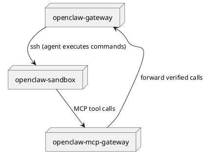
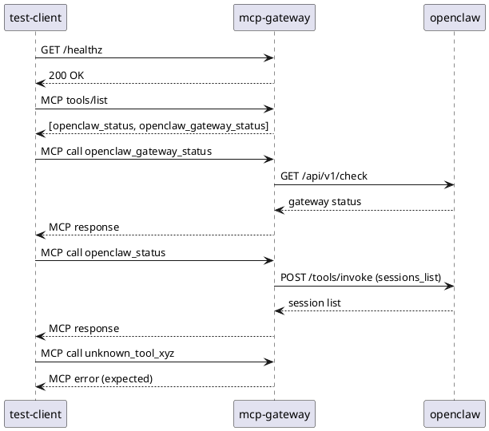

# Secure Access To OpenClaw From Sandbox

Give sandboxed SSH AI agents controlled access to [OpenClaw](https://github.com/mwaeckerlin/openclaw) through this MCP gateway service.

AI agents running inside SSH-isolated and Docker-sandboxed environments cannot — and should not — reach OpenClaw directly. Instead they talk only to this lightweight MCP service, the single bridge allowed through the network boundary. The gateway enforces a hardcoded allowlist of operations: the AI agent cannot choose which HTTP endpoint is called, cannot modify the payloads sent to OpenClaw, and cannot inject arbitrary commands. This makes the overall architecture significantly more secure than any setup where the AI has direct HTTP access to OpenClaw.



## About mwaeckerlin/openclaw

[mwaeckerlin/openclaw](https://github.com/mwaeckerlin/openclaw) is a multi-agent orchestration platform that gives AI assistants real-world capabilities — browser automation, code execution, file management, API calls — inside a controlled, auditable gateway. Each session runs in its own isolated environment; agents invoke tools through a REST API and a tool invocation protocol.

## MCP Tools

| MCP Tool | Method | OpenClaw Endpoint | Description |
|---|---|---|---|
| `tools/list` | `GET` | (no) | Lists all available MCP tools |
| `openclaw_status` | `POST` | `/tools/invoke` (tool: `sessions_list`) | Lists active OpenClaw sessions |
| `openclaw_gateway_status` | `POST` | `/api/v1/check` | Checks OpenClaw gateway health |

## Security

This service provides three independent layers of security. You do not have to trust any single layer — all three must be bypassed simultaneously to compromise the system.

**1. Sandbox isolation — the AI agent cannot reach OpenClaw or the internet directly.**
The AI agent runs inside a Docker container or SSH-isolated environment. Its only allowed outbound connection is to this MCP gateway on one port. Even if the AI is manipulated or "jailbroken", it cannot contact OpenClaw, the host system, or any other network resource.

**2. Fixed-allowlist MCP gateway — the AI agent cannot choose what it sends.**
Every MCP tool call is mapped to a single, hardcoded OpenClaw operation defined at build time. There is no dynamic endpoint selection, no user-controlled payload fields, no shell execution, and no eval. The AI cannot escalate a `tools/list` or `openclaw_status` call into an arbitrary HTTP request. The MCP gateway is the only component with network access to OpenClaw, and it acts as a strict one-way firewall.

**3. Hardened container image — the runtime has the smallest possible attack surface.**
The production image is built on [`mwaeckerlin/nodejs`](https://github.com/mwaeckerlin/nodejs), a purpose-built, minimal Node.js base image. It runs as a non-root user, contains no shell or package manager, and ships only the files required to execute the application. The total image size is only **91.8 MB**. There is nothing inside the container that an attacker could use to escalate privileges or pivot to other systems.

## Configuration

> ⚠️ **Production rule: never pass secrets as environment variables.**
> Use Docker secrets instead (mounted at `/run/secret/openclaw_gateway_token`). Environment variables can leak through log files, `/proc`, container inspection, and child processes.

| Variable | Required | Description |
|---|---|---|
| `OPENCLAW_GATEWAY_URL` | yes | Base URL of the OpenClaw Gateway, e.g. `http://localhost:18789` |
| `OPENCLAW_GATEWAY_TOKEN` | yes* | Bearer token for Gateway authentication |
| `OPENCLAW_GATEWAY_KEY` | yes* | Legacy alias for `OPENCLAW_GATEWAY_TOKEN` |
| `OPENCLAW_MCP_HOST` | no | Host to bind (default: `0.0.0.0`) |
| `OPENCLAW_MCP_PORT` | no | Port to listen on (default: `4000`) |

\* One of `OPENCLAW_GATEWAY_TOKEN` or `OPENCLAW_GATEWAY_KEY` is required. In production, mount the token as a Docker secret at `/run/secret/openclaw_gateway_token` — no environment variable needed.

## Local Development

```bash
npm install
npm run build   # compiles TypeScript and builds the Docker image
npm test        # runs unit tests, then E2E tests inside Docker Compose
```

## Running

```bash
npm start
```

Runs `docker compose up --build --force-recreate --remove-orphans` and starts the full stack.

Compose defaults (override via environment variables in development only):

- `OPENCLAW_GATEWAY_URL=http://localhost:18789`
- `OPENCLAW_GATEWAY_TOKEN=test-gateway-token`

## End-to-End Tests

`test/docker-compose.yml` brings up three services and runs end-to-end assertions against a live OpenClaw gateway:



```bash
cd test
docker compose up --build --force-recreate --remove-orphans --abort-on-container-exit --exit-code-from test-client
```

Optional overrides:

- `OPENCLAW_E2E_GATEWAY_TOKEN` (default: `test-gateway-token`)
- `OPENCLAW_E2E_OPENAI_API_KEY` (default: `test-openai-key`)

## MCP Client Example

```json
{
  "mcpServers": {
    "openclaw-gateway": {
      "transport": "streamable-http",
      "url": "http://127.0.0.1:4000",
      "headers": {
        "Authorization": "Bearer your-gateway-token"
      }
    }
  }
}
```

